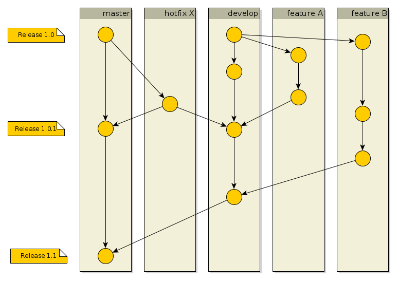

# Contributing Guidelines

First of all, thank you very much for being interested in contributing to the oersi! Contributions of any kind are welcome - for example proposing a new source of Open Educational Resources, submitting a bug report, requesting a new feature, translating the application into a new language, or actively contributing to the source code.

If you want to contribute to the OER search index, please make sure to read through and follow these guidelines. The guidelines apply to all oersi repositories.

If you need help or have any questions that are not covered by this guide, please contact us at contact-project+oersi-oersi-setup-support1@incoming.gitlab.com

## Table of Contents

[[_TOC_]]

## Submitting an Issue

Before creating a new issue, start by searching through the issues and open merge requests to see whether someone else has raised a similar idea or question. If you don't see your idea listed, do one of the following:
* If your contribution is a minor change of the code, such as a typo fix, open a merge request.
* Otherwise open an issue first. That way, other people can weigh in on the discussion before you do any work.

### Propose source of Open Educational Resources

We are interested in more sources that contain OERs in the higher education context and welcome any suggestions. Please use the following template: https://gitlab.com/oersi/oersi-etl/-/issues/new?issuable_template=add-source

### Adding translation

We are happy to accept new languages for the OERSI frontend and labels in the data. Please use the following template: https://gitlab.com/oersi/oersi-frontend/-/issues/new?issuable_template=add-translation and see also [Add new language](doc/INTERNATIONALIZATION.md#add-new-language)

### Bug Report

Bug reports include anything that causes the application to behave in an unintended way. Please describe the error as detailed as possible (where did the error occur, what happened, what are the consequences) and tell us what is your expected behavior in the case. Please also describe how the error can be reproduced.

### Change / Feature Request

Changes / Feature Request include any functional code that should be adjusted / added. This can include small adjustments or translations, but it can also include large adjustments. The change or new feature should be described in detail, as well as the problem that should be solved. What exactly needs to be changed / added and how the system should behave. It is also very important to specify the use case for the issue, so that it is clear why the issue should be implemented.

## Contributing to the source code

Please ensure that you comply with the license, coding conventions, definition of done and the workflow for submitting merge requests. 

Contributions to an issue are always developed in a feature branch. The feature-branch may only contain changes for one issue - contributions to different issues may not be mixed in one MR.

Please also refer the [development documentation](doc/DEVELOPMENT.md).

When you select tasks for development, you can either search the repository for existing issues to work on, or you can submit your own issues if you don't find any that cover the topic of your interest (see the [Submitting an Issue](#submitting-an-issue) section of this guide). Issues that you want to work on should first be marked with the label `approval requested` and then wait for one of the core developers to discuss and approve the development with you.

### Workflow for external contributers

* Fork the project into your personal namespace (or group).
* Create a feature branch in your fork from master (don't work off master).
* Write tests, code and documentations that satisfy [coding conventions](#coding-conventions).
* When the feature is fully implemented (see [Definition of Done](#definition-of-done)), submit a merge request to the master branch in the original project. One of the core developers will then look at the MR, discuss any adjustments with you, and once everything is ok, merge the MR.

### Coding conventions

* Code Style: [Google Code Style](https://google.github.io/styleguide/)
* No issues in [sonarlint](https://www.sonarlint.org/).
* [sonarcloud](https://sonarcloud.io/) Quality Gate passed for the merge request.
* Automated tests for new code should always be added.
* Language: everything (source code, comments, documentation, ...) in English.
* Commit messages guidelines
     * The commit subject must not contain more than 72 characters.
     * The commit subject and body must be separated by a blank line.
     * The issue or merge request should be added to the commit message.
     * Use issues and merge requests' full URLs instead of short references.

### Definition of Done

When can a task be marked as "finished"?

* All requirements of the feature implemented / all acceptance criteria fulfilled.
* Documentation is completely finished and understandable.
* Automated tests (e.g. unit tests) have been created, code coverage > 80%
* No open bugs (testing with [sonarlint](https://www.sonarlint.org/) / [sonarcloud](https://sonarcloud.io/))
* The code is finished and merged into the master branch.
* Concluding short comment in the issue: what has been done / what is the current status?

### OERSI Branching Strategy

* master
     * long living
     * stable branch (all merges and commits are "ready-for-production")
* feature- / topic-branches
     * branch from master
     * merge into master when ready (see [Definition of Done](#definition-of-done))
     * stability can be achieved by testing the feature-branch in the local Vagrant VM first and/or by using feature toggles.
     
**Note:** we do not support hotfixes. Bugs are fixed in the current master.
     

