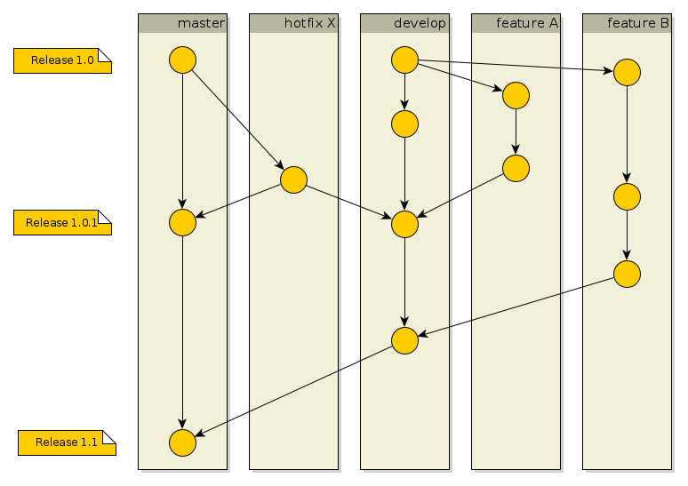

# Contributing

If you contribute to the OER search index repositories, please ensure that you comply with the coding conventions, definition of done and the workflow for submitting merge requests. 

## Coding conventions

* Code Style: [Google Code Style](https://google.github.io/styleguide/)
* no issues in [sonarlint](https://www.sonarlint.org/)
* always add automated tests for new code
* language: everything (source code, comments, documentation, ...) in English

## Definition of Done

When can a task be marked as "finished"?

* All requirements of the feature implemented / all acceptance criteria fulfilled
* Documentation is completely finished and understandable
* automated tests (e.g. unit tests) have been created, code coverage > 80%
* no open bugs (testing with [sonarlint](https://www.sonarlint.org/) / [sonarcloud](https://sonarcloud.io/))
* the code is finished and merged into the development branch
* concluding short comment: what has been done / what is the current status?

## Branching Strategy

### Internal Branching Workflow (gitflow)

* master
     * long living
     * stable branch
     * contains only release versions
* develop
     * long living
     * stable development branch
     * merge into master when ready for release
* feature- / topic-branches
     * branch from develop
     * merge into develop when ready / fully implemented (see [Definition of Done](#definition-of-done))
* hotfix
     * branch from master
     * for urgent fix in released version
     * merge into master and develop when ready
     

### Workflow for external contributors

Any developer interested in collaborating should fork the repository and work on that local copy on a specific feature/topic. When the feature is fully implemented (see [Definition of Done](#definition-of-done)), a merge request can be opened to merge the changes into the development branch of the original repository.
