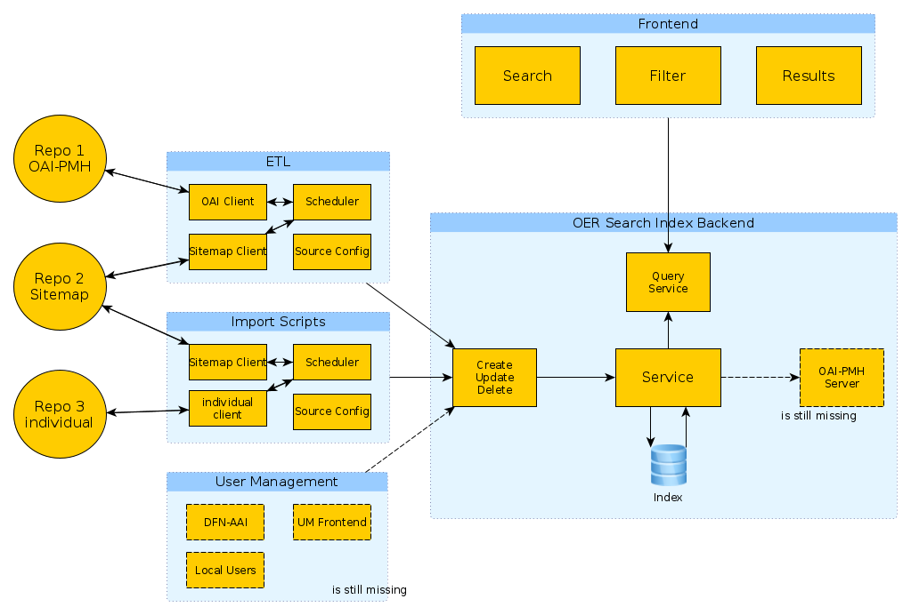

# **Under Development**

first draft

# OER Search Index Setup

The search index offers the possibility to search quickly in various oer sources.

With this project you can set up all components that are necessary to run the index. The process uses [ansible](https://docs.ansible.com/) to install the components.

You can find stable versions of the setup in the branch **_master_**.

## Concept


### Central Index

As a link between the individual OER repositories, the index harvests (e.g. daily) the repositories of the federal states, or generally data sources that provide metadata, such as the AV portal, SlideWiki etc.

### Local Index

The same index can also be reused at the level of a federal state (or generally distributed), assuming that no data storage is required, but only linking of content (e.g. from LMS or GitLab). Here the harvester can be used to read out e.g. the LMS of the universities or a state-wide GitLab instance. Alternatively, a user management system can be connected for this purpose, with which individual persons can insert, change or delete their own content.

### Components

* **Harvester**: The harvester connects to the individual repositories and fetches metadata updates according to a configured schedule (e.g. daily).
* **API / Backend**: Provides interfaces to retrieve data from the index (external) and to import / update data into the index (internal). A read-only user is used to retrieve data. When creating / updating the data, the data is first written into an SQL database and from there written into an elasticsearch index with the help of logstash.
* **Frontend**: Website that displays the data from the index and offers the possibility to search
* **User Management**: _Optional_ - only needed if the index is used as a (local) standalone solution. So users can be given access to manually update the data via a UI.



## Installation

* requirements:
     * [ansible](https://docs.ansible.com/) installed on the local computer
* clone project
* install ansible galaxy roles:
     * ```ansible-galaxy install -r requirements.yml```
* create ansible inventory _config.yml_ (see [config-example.yml](config-example.yml)) and adjust all variables to your installation (see variables in _ansible/group_vars_)
* run ```ansible-playbook -v -i config.yml ansible/system.yml```

## Automatic installation via gitlab ci

* Create a new private gitlab project that will contain the configuration for your oersi-systems
* Assure your gitlab-project is able to connect to your oersi-systems via ssh
     * Create an ssh-key for the automatic installation via gitlab
     * Your public ssh-key needs to be added to the authorized_keys file on your oersi-systems
     ```
     vi ~/.ssh/authorized_keys
     chmod 600 ~/.ssh/authorized_keys
     ```
     * go to **Settings** -> **CI / CD** -> **Variables** of your project in gitlab and add variables
          * **SSH_KNOWN_HOSTS** - contains entries for your oersi-systems
          * **SSH_PRIVATE_KEY** - your private ssh-key
* Use _.gitlab-ci.yml_, _oersi-playbook.yml_ and _prerequisites.yml_ from the [gitlab-config-example](doc/gitlab-config-example)
* Create your own inventory-files with help of _inventory_DEV.yml_ and _inventory_TEST.yml_
     * When you adjust the filenames of your inventory-files, please assure to also adjust the filenames in _.gitlab-ci.yml_
     * Assure root access via [ansible connection variables](https://docs.ansible.com/ansible/latest/user_guide/become.html#become-connection-variables) like _ansible_become_password_.
     * **oersi_setup_branch** - _master_ for latest release version, _develop_ for latest stable development version
* Now you should be able to update your systems via your gitlab-project
     * Call: **CI / CD** -> **Pipelines** -> **Latest**
     * Click the "Play"-Button for the system you want to update
* Optionally you can activate Continuous Delivery
     * Create a Gitlab-Schedule in your project **CI / CD** -> **Schedules**
     * uncomment "scheduled deployment" section in _.gitlab-ci.yml_ and adjust to your inventory-filename

## Run it locally 

Set up an oer-search-index in a virtual machine with minimal effort.

Prerequisites
* [Git](https://git-scm.com/downloads) (tested with 2.17.1)
* [Vagrant](https://www.vagrantup.com/downloads.html) (tested with 2.0.2)
* [VirtualBox](https://www.virtualbox.org/wiki/Downloads) (tested with 5.2.34_Ubuntu)

Perform the following steps in the terminal (Linux / macOS) or in the GitBash (Windows).
```
git clone https://gitlab.com/oersi/oersi-setup.git
cd oersi-setup
vagrant up
```
When the installation is complete (a few minutes, depending on the download speed), the index can be opened in the browser

<http://192.168.98.115/>

You can stop the virtual machine with
```
vagrant halt
```
... and start again with
```
vagrant up
```
If you want to reload the configuration (including the import from the oer sources), perform
```
vagrant reload --provision
```

## Contributing

Contributions are welcome. Please read [CONTRIBUTING.md](CONTRIBUTING.md) for further details.

## Technologies

- **Scrapy**: First OER repositories are crawled using [Scrapy](http://scrapy.org/) -> just for the first prototype; a general, robust approach has to be developed (see https://gitlab.com/oersi/oersi-metadata-harvester)
- **MariaDB**: Used to store the results of Scrapy.
- **Logstash**: Logstash is regulary checking the MariaDB database, if any new items are added or changes are made to existing entries.
- **Elasticsearch**: Elasticsearch is the search engine and indexes the input it gets from Logstash.
- **Kibana**: For development or monitoring of Elasticsearch Kibana can be installed optionally (activate in _ansible/group_vars_ -> _kibana_install_)
- **Backend**: The backend is the interface for read/write access to the index, see https://gitlab.com/oersi/oersi-backend
- **Frontend**: The frontend is used from https://gitlab.com/oersi/oersi-frontend

## License

This project is licensed under the MIT License - see the [LICENSE](LICENSE) file for details.

## Acknowledgments

Inspired by [OERhoernchen 2.0](https://github.com/programmieraffe/oerhoernchen20) (by [Matthias Andrasch](https://twitter.com/m_andrasch)) and [Docker-Hoernchen 2.0](https://github.com/sroertgen/oerhoernchen20_docker) (by [Steffen Rörtgen](https://github.com/sroertgen)).